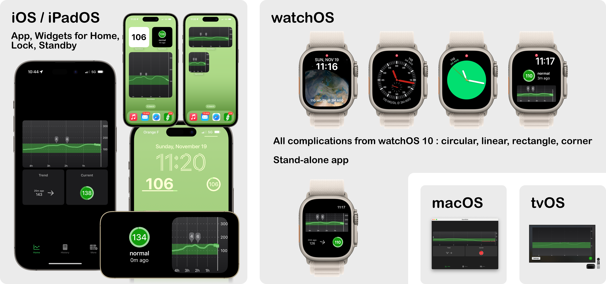

# OpenGlück

The OpenGlück project is a collection of free software that can be used to help
build a riche ecosystem of apps and tools for diabetes users.

## Features

- **modern apps for all platforms**: iOS, watchOS, iPadOS, macOS, tvOS — no more more hunting for your phone to know your blood glucose, a quick glance and you know;
- **supports all widgets and complications** — and we support StandBy mode;
- if you care for someone with diabetes, you can easily see their results — as many users as required can share the same server.

### OpenGlück IS:

- **OpenGlück is a foundation**, a building layer upon which other software can be plugged. Think of it like a digital journal where you choose to log what's relevant for you;
- **OpenGlück is open**, so you have freedom over how and when you handle your workflow.

### OpenGlück IS NOT:

- OpenGlück is NOT a medical device, a CGM or a closed-loop system, or anything like this. 
- If you're using a CGM, you need to continue using a dedicated app to read your blood glucose. If you're using a closed-loop system, you need to continue using it. And, you can use OpenGlück on top of it.

# Apple Watch

## Complications

All complications for watchOS 10 are supported.

And, if you have a Series 9 or Ultra 2, you can use the *double tap* gesture. I have mine configured so that a *single double tap* shows the graph, and a *second double tap* opens the app. Very handy!

# iPhone

## Lock Screen and Home Screens Widgets

All widgets for iOS 17 are supported.

# iPad

All widgets for iPadOS 17 are supported.

TODO

# macOS

TODO

# tvOS

TODO

# Pre-Requisites

In order to have OpenGlück work on your iPhone, Apple Watch, iPad, Mac, or TV, you need to set up a few things first:

- the [OpenGlück server](https://github.com/open-gluck/opengluck-server) on a machine that's always on, and ready to accept HTTPS connections (you can use a cheap cloud instance, or a computer at home that's never turned off);
- use an app that's compatible with OpenGlück (see a list below). You can use [our own app](https://github.com/open-gluck/opengluck-ios) — that's how you'll get the widgets and complications shown above. But you can also use any other apps compatible with OpenGlück.

## Compatible Apps

The [OpenGlück server](https://github.com/open-gluck/opengluck-server) is a small piece of software, that's agnostic of which CGM, blood glucose reader, closed loop system or any of your hardware. Instead, if relies on two things:
- its exhaustive API to import and retrieve data;
- its convenient webhooks feature to support for plug-ins to react when things happen (like a new reading, a new insulin shot is recorded, etc.)

Below is a list of supported software:

- [our own OpenGlück app](https://github.com/open-gluck/opengluck-ios) to provide readings, graphs, widgets and complications (supports iOS 17, watchOS 10, macOS Sonoma, or above);

- [xDrip4iOS](https://xdrip4ios.readthedocs.io/en/latest/) is supported with the following pull request that you need to apply.

# FAQ

## Any creative use of OpenGlück?

Sure, what about these ideas:
- create a plug-in that turn on your smart lights when you're low at night;
- upload all your readings to a Google sheet and make a plug-in that send you weekly reports about how you're doing;
- most of us with a CGM have alerts when they experience a low or high, but what about alerts when back in the normal range? turns out we have a [plugin, `opengluck-webhooks-apns`](https://github.com/open-gluck/opengluck-webhook-apns) that does exactly that;
- and, this list is not over!

## How can widgets be refreshed more than a few dozens time per day?

Apple has a restriction on the number of times widgets can be refreshed every day. This restriction is based on several factors, such as the number of times you interact with a widget. 

Unfortunately, this restriction is not developer- or user-configurable, which means we don't have a way to raise this limit higher to suit our needs — and neither do you have a way.

While this is done on purpose to help keep battery usage low, our findings is that battery footprint is actually quite minimal — this is because we're very cautious about performing minimal work. Somehow, we understand Apple enforces a limit, because it would be quite easy for developers to drain battery life, and users would blame Apple, though we believe there should be a way for some apps to have their restrictions lifted — maybe watchOS could monitor battery usage and report abnormal consumption to you, so that you could make informed decisions. But, alas, we're not there yet. Feel free to reach out to Tim Cook, Apple's current CEO: he is known to read his mails and sometimes responds. His email is tcook@apple.com.

In the meantime, **if you're really interested in refreshing your widgets and complications data more often, there is a way.** By default, we restrict to once every 30 minutes at most, but **you can ask for a refresh every 2 minutes** (which in practice turns out to be once every 10 minutes, which is more than okay for what we use the widgets and complications for).

To do so, you need to enroll in the [Apple Developer Program](https://developer.apple.com/programs/), compile the app yourself, and install it on your device.

Once you are a registered developer, you can enable *Developer Mode* on your device, which gives you access to a secret menu, where you can lift restrictions concerning how often WidgetKit widgets are refreshed.

Once again, **this is not required to use OpenGlück**. If, for some reasons, you can't enroll or don't want to enroll, you can still use other features. Sure, your widgets and complications will refresh less often, but that's about it. Just click on them, this will launch the app, and your data will instantly refresh.

### Lift WidgetKit Restrictions (For Registered Developers)

If you're a registered developer, you can lift WidgetKit restrictions like so.

*Important: WidgetKit Developer Mode is enabled only for apps you build and install on your devices. It has no impacts on apps downloaded from the App Store or Test Flight.*

#### Apple Watch

Open **Settings**, then navigate to **Developer**. In the secret menu, check **WidgetKit Developer Mode**. 

#### iPhone, iPad

Open **Settings**, then navigate to **Developer**. In the secret menu, check **WidgetKit Developer Mode**. 

### The Calendar Trick (now deprecated)

Early versions of this software used a hack with a contact photo that was updated whenever the blood glucose change. That's cool but once in a while, the data wasn't being updated, and there was a serious risk of applying a wrong decision because data was simply not up to date. This is the same issue that appears with other software that use similar methods, such as the “calendar” app (though the Contacts app might be more elegant as it visually a circle that's available in more watch faces).

If you're interested, the code for updating the contact photo is still present, feel free to dig with it. Personally I'm not confident it's worth the risk, but I'm always open for discussion.

# Do you need your iPhone to use the Apple Watch app?

No, but your CGM or closed-loop system still might.

But, if you have a cellular Apple Watch, and don't need your phone, you'll be good to go.

## Does OpenGlück support “follower” mode?

Sure, just share the same token.

## Does OpenGlück support multiple users?

Sure, each users get its own journal. If you're sharing the same server with two diabetics or more, this is the way to go. Each user will get a token that will show their data only.

## Why didn't you build up on NightScout/other alternative?

**OpenGlück is a foundation**, freeing you from whatever software and hardware you use. It's open and we encourage anyone, with an interest in making life easier for diabetes users, to contribute.

Think about it like an Apple TV: when you own one, you're no longer stuck to using the set-top-box of your internet provider. This is good for you, as consumer: you can change provider whenever you like and still, use the same friendly interface you're used to. And if your internet provider provides special features that you'll like, you're also free to use them, in addition to your Apple TV. That's freedom, you can choose to go your own path, when you decide.