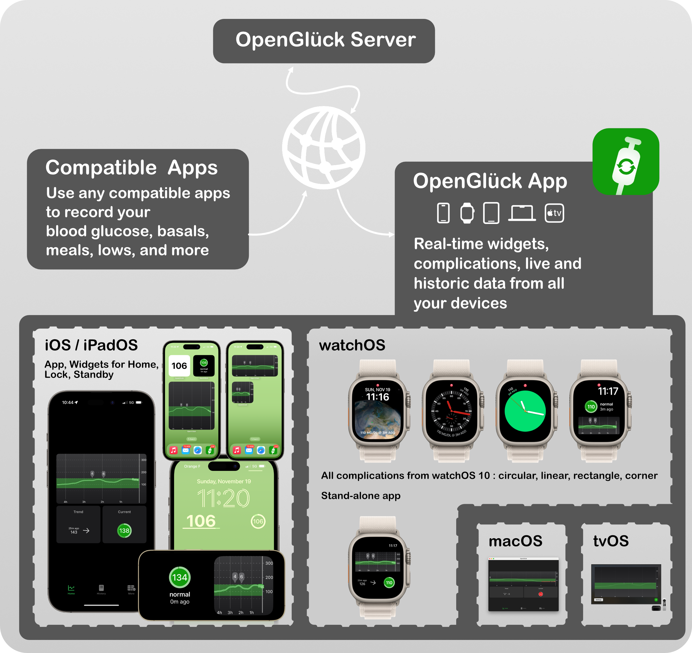

# OpenGlück

The OpenGlück project is a collection of free software to help diabetics get a better understanding of their diabetes, regardless of the brand of the hardware they're using. 

It comes with its own app for iPhone, Apple Watch, macOS (and more) that's fully packed with widgets and complications, and any app can add support.

To run OpenGlück, you need a server, and apps to upload and download data. We also suggest you install [our own app](https://github.com/open-gluck/opengluck-swift-app), that is compatible with iPhone, watchOS, macOS and tvOS.

## A Quick video tour

Here is a [YouTube video showing how OpenGlück looks](https://www.youtube.com/watch?v=1x_gM2B7ZmE), on iPhone and Apple Watch:

## Features

- **modern apps for all platforms**: iOS, watchOS, iPadOS, macOS, tvOS — no more more hunting for your phone to know your blood glucose, a quick glance and you know;
- **supports all widgets sizes and complications layouts** — including StandBy mode;
- if you care for someone else, **follower mode** is supported right out of the box,
- last, but maybe not least, **we love to have a nice UI/UX** for user-facing projects. The server? not something you'll see everyday. The app? Make it look right. Our motto: *Your diabetes might not be pretty every day, but if your app is. At least that's something.*

### OpenGlück IS:

- **OpenGlück is a foundation**, a building layer upon which other software can be plugged. Think of it like a digital journal where you choose to log what's relevant for you;
- **OpenGlück is open**, so you have freedom over how and when you handle your workflow.
- **OpenGlück is early work**. I started the project as hoppy of mine, if it can be useful to others, great! Let me hear your stories, and of course, your help is welcome, feel free to participate.

### OpenGlück IS NOT:

- OpenGlück is NOT a medical device, a CGM or a closed-loop system, or anything like this. 
- If you're using a CGM, you need to continue using a dedicated app to read your blood glucose. If you're using a closed-loop system, you need to continue using it. And, you can use OpenGlück on top of it.

# Apple Watch

These screenshots showcase [our own app](https://github.com/open-gluck/opengluck-swift-app).

## Complications

All complications sizes for watchOS 10 are supported.

If you have a Series 9 or Ultra 2, you can use the *double tap* gesture. I have mine configured so that a *single double tap* shows the graph, and a *second double tap* opens the app. Very handy!

(Remember that we're subject to the same limitation than all Apple Watch widgets. If you're not running a version of the app that you've compiled yourself, we support a workaround with the **Contact Trick**, see the FAQ item below. Also, opening the app always show live data. Double tap to the rescue!)

# iPhone / iPad

The [OpenGlück app](https://github.com/open-gluck/opengluck-swift-app) supports all widgets sizes of iOS 17, including Standby Mode — if you are lucky and have an iPhone with Always-On, this makes a great nighttime BG reader.

# macOS

The [native Mac app](https://github.com/open-gluck/opengluck-swift-app) means you don't have to reach out for your phone to know your blood glucose.

# tvOS

Well, tvOS started more as a joke than anything else. Please let me know if you have serious uses for it, though, I'd be more than happy to read about it.

# Pre-Requisites

In order to have OpenGlück work on your iPhone, Apple Watch, iPad, Mac, or TV, you need to set up a few things first:

- the [OpenGlück server](https://github.com/open-gluck/opengluck-server) on a machine that's always on, and ready to accept HTTPS connections (you can use a cheap cloud instance, or a computer at home that's never turned off);
- use an app that's compatible with OpenGlück (see a list below). You can use [our own app](https://github.com/open-gluck/opengluck-swift-app) — that's how you'll get the widgets and complications shown above. But you can also use any other apps compatible with OpenGlück.

## Compatible Apps

*Stars indicates full support of OpenGlück.*

The ⭐️ [OpenGlück server](https://github.com/open-gluck/opengluck-server) is a small piece of software, that's agnostic of which CGM, blood glucose reader, closed loop system or any of your hardware. Instead, if relies on two things:
- its exhaustive API to import and retrieve data;
- its convenient webhooks feature to support for plug-ins to react when things happen (like a new reading, a new insulin shot is recorded, etc.)

Below is a list of supported software. 

- ⭐️ [our own OpenGlück app](https://github.com/open-gluck/opengluck-swift-app) to provide readings, graphs, widgets and complications (supports iOS 17, watchOS 10, macOS Sonoma, or above);

- ⭐️ [xDrip4iOS](https://xdrip4ios.readthedocs.io/en/latest/) is supported with the following pull request that you need to apply (we've reached out to the project's team to have it merged).

# FAQ

## Any creative use of OpenGlück?

Sure, what about these ideas:
- create a plug-in that turn on your smart lights when you're low at night;
- upload all your readings to a Google sheet and make a plug-in that send you weekly reports about how you're doing;
- most of us with a CGM have alerts when they experience a low or high, but what about alerts when back in the normal range? turns out we have a [plugin, `opengluck-webhooks-apns`](https://github.com/open-gluck/opengluck-webhook-apns) that does exactly that;
- and, this list is not over!

## What info does the Home screen show? What's with the round circle around the blood glucose, and why do some points show as crosses?

The blood glucose graph shows historic data as a straight line. The most recent data is shown as *crossed*: this let you see at first sight how your CGM is currently trending. Typically, this data is less reliable, and will get corrected as your sensor collects more data: most readers use to apply a *smoothing* algorithm to even out short spikes and other reading errors.

The last historic data is shown with a trend arrow, that has the same slope as the graph.

Current blood glucose data is shown with a a colored background, that instantly shows if you're in a low/high. You can configure the thresholds in the settings.

A circle around the measurement shows how fresh the result is. This circle will slowly decrease up until it reaches 10 minutes, at which point it will consider the data no longer to be up to date. This is important as it will prevent you from misinterpreting an old result.

## How can widgets be refreshed more than a few dozens time per day?

Apple has a restriction on the number of times widgets can be refreshed every day. This restriction is based on several factors, such as the number of times you interact with a widget. 

Unfortunately, this restriction is not developer- or user-configurable, which means we don't have a way to raise this limit higher to suit our needs — and neither do you have a way. 

But we do have something in our sleeve: the **Calendar Trick**. If you're not enrolled in the developer program, you can use this trick to update the photo or a contact with your blood glucose. See the next question for details.

### The Calendar Trick

You can enable the **Calendar Trick** in the **More** tab. When enabled, the app will search for a contact and update its photo with the latest known blood glucose.

To enable the Calendar Trick:

1. Create a contact, set its email address to `bg@calendar-trick.opengluck.com`
1. Launch the OpenGlück app, in the **More** tab, click **Enable Calendar Trick**.
1. On your watch, update any of your circular complications to a **Contact complication**, and choose the contact you created in step 1.
1. You're all set! OpenGlück will update the contact, and Apple Watch will automatically sync the complication to the contact's current photo.

*IMPORTANT: the update process may fail, or stop, for whatever reasons, and there could be issues with the iCloud sync internally used by Apple's Contacts app. While most of the time, Calendar Trick provides for near real-time updates, be advised the there are times it might lag behind, and show you an outdated value — you might only get the latest available result, which could lag several minutes, hours, or even days. The app has a counter-measure to show the value in gray after some times passes, but unfortunately that is no fail-proof. (Some other apps use a similar trick known as the *Calendar trick*, with similar caveats.)*

### Disable WidgetKit Limits (Developers Only)

While Apple's limits are done on purpose to help keep battery usage low, our findings is that battery footprint is actually quite minimal — this is because we're very cautious about performing minimal work. Somehow, we understand Apple enforces a limit, because it would be quite easy for developers to drain battery life, and users would blame Apple, though we believe there should be a way for some apps to have their restrictions lifted — maybe watchOS could monitor battery usage and report abnormal consumption to you, so that you could make informed decisions. But, alas, we're not there yet. Feel free to reach out to Tim Cook, Apple's current CEO: he is known to read his mails and sometimes responds. His email is tcook@apple.com.

In the meantime, **if you're really interested in refreshing your widgets and complications data more often, there is a way.** By default, we restrict to once every 30 minutes at most, but **you can ask for a refresh every 2 minutes** (which in practice turns out to be once every 10 minutes, which is more than okay for what we use the widgets and complications for).

To do so, you need to enroll in the [Apple Developer Program](https://developer.apple.com/programs/), compile the app yourself, and install it on your device.

Once you are a registered developer, you can enable *Developer Mode* on your device, which gives you access to a secret menu, where you can lift restrictions concerning how often WidgetKit widgets are refreshed.

Once again, **this is not required to use OpenGlück**. If, for some reasons, you can't enroll or don't want to enroll, you can still use other features. Sure, your widgets and complications will refresh less often, but that's about it. Just click on them, this will launch the app, and your data will instantly refresh.

If you're a registered developer, you can lift WidgetKit restrictions like so.

*Important: WidgetKit Developer Mode is enabled only for apps you build and install on your devices. It has no impacts on apps downloaded from the App Store or Test Flight.*

#### Apple Watch

Open **Settings**, then navigate to **Developer**. In the secret menu, check **WidgetKit Developer Mode**. 

#### iPhone, iPad

Open **Settings**, then navigate to **Developer**. In the secret menu, check **WidgetKit Developer Mode**. 

## Do you need your iPhone to use the Apple Watch app?

No, but your CGM or closed-loop system still might.

But, if you have a cellular Apple Watch, and don't need your phone, you'll be good to go.

## Does OpenGlück support “follower” mode?

Sure, just share the same token.

## Does OpenGlück support multiple users?

Sure, each users get its own journal. If you're sharing the same server with two diabetics or more, this is the way to go. Each user will get a token that will show their data only.

## I'm using mmol/L.

Sure, visit the settings, you can change the unit there.

## Why didn't you build up on NightScout/other alternative?

**OpenGlück is a foundation**, freeing you from whatever software and hardware you use. It's open and we encourage anyone, with an interest in making life easier for diabetes users, to contribute. As it's not tied to a specific hardware, it will be able to evolve as new devices are available.

Think about it like an Apple TV: when you own one, you're no longer stuck to using the set-top-box of your internet provider. This is good for you, as consumer: you can change provider whenever you like and still, use the same friendly interface you're used to. And if your internet provider provides special features that you'll like, you're also free to use them, in addition to your Apple TV. That's freedom, you can choose to go your own path, when you decide.
